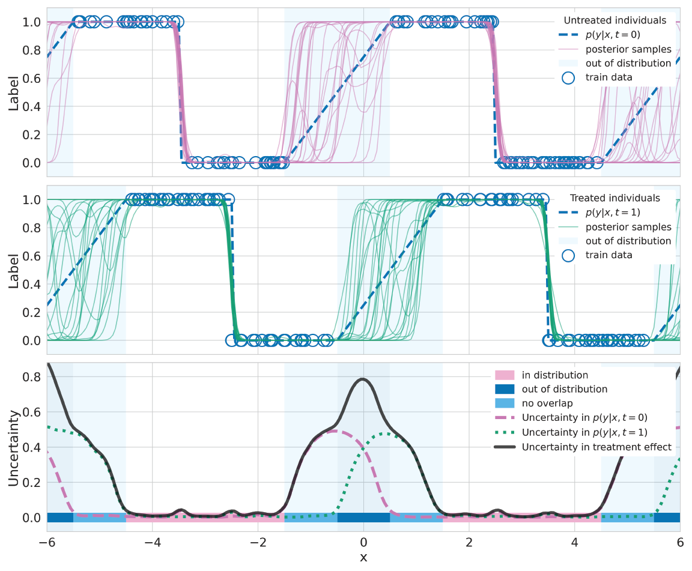

# Introduction
This repository contains the code to replicate the results reported in 
[Identifying Causal Effect Inference Failure with Uncertainty-Aware Models](https://arxiv.org/abs/2007.00163).



## Installation
```
$ git clone git@github.com:anndvision/ucate.git
$ cd ucate
$ conda env create -f environment.yml
$ conda activate ucate
```

### Download data
```
$ mkdir data
```

To run the following experiments, the IHDP [train](http://www.fredjo.com/files/ihdp_npci_1-1000.train.npz.zip), 
[test](http://www.fredjo.com/files/ihdp_npci_1-1000.test.npz.zip), and 
[ACIC2016](https://jenniferhill7.wixsite.com/acic-2016/competition) datasets must be downloaded into the folder created 
above. The datasets will need to be uncompressed.

## BTLearner Experiment
###  IHDP
```
$ ucate train \
    --job-dir ~/experiments/ucate \
    --dataset-name ihdp \
    --data-dir data/ \
    --num-trials 1000 \
    tlearner
$ ucate evaluate \
    --experiment-dir ~/experiments/ucate/ihdp/tlearner/bf-200_dp-5_dr-0.5_bs-100_lr-0.001_ep-False
```

###  IHDP Covariate Shift
```
$ ucate train \
    --job-dir ~/experiments/ucate \
    --dataset-name ihdp \
    --data-dir data/ \
    --num-trials 1000 \
    --exclude-population True
    tlearner
$ ucate evaluate \
    --experiment-dir ~/experiments/ucate/ihdp/tlearner/bf-200_dp-5_dr-0.5_bs-100_lr-0.001_ep-False
```

###  CEMNIST
```
$ ucate train \
    --job-dir ~/experiments/ucate \
    --dataset-name cemnist \
    --data-dir data/ \
    --num-trials 20
    tlearner
$ ucate evaluate \
    --experiment-dir ~/experiments/ucate/cemnist/tlearner/bf-200_dp-5_dr-0.5_bs-100_lr-0.001_ep-False
```

###  ACIC
```
$ ucate train \
    --job-dir ~/experiments/ucate \
    --dataset-name acic \
    --data-dir data/data_cf_all/ \
    --num-trials 77
    tlearner
$ ucate evaluate \
    --experiment-dir ~/experiments/ucate/acic/tlearner/bf-200_dp-5_dr-0.5_bs-100_lr-0.001_ep-False
```

## BTARNet Experiment
###  IHDP
```
$ ucate train \
    --job-dir ~/experiments/ucate \
    --dataset-name ihdp \
    --data-dir data/ \
    --num-trials 1000 \
    tarnet
$ ucate evaluate \
    --experiment-dir ~/experiments/ucate/ihdp/tarnet/md-tarnet_bf-200_dr-0.5_beta-1.0_bs-100_lr-0.001_ep-False
```

###  IHDP Covariate Shift
```
$ ucate train \
    --job-dir ~/experiments/ucate \
    --dataset-name ihdp \
    --data-dir data/ \
    --num-trials 1000 \
    --exclude-population True
    tarnet
$ ucate evaluate \
    --experiment-dir ~/experiments/ucate/ihdp/tarnet/md-tarnet_bf-200_dr-0.5_beta-1.0_bs-100_lr-0.001_ep-True
```

###  CEMNIST
```
$ ucate train \
    --job-dir ~/experiments/ucate \
    --dataset-name cemnist \
    --data-dir data/ \
    --num-trials 20
    tarnet
$ ucate evaluate \
    --experiment-dir ~/experiments/ucate/cemnist/tarnet/md-tarnet_bf-200_dr-0.5_beta-1.0_bs-100_lr-0.001_ep-False
```

###  ACIC
```
$ ucate train \
    --job-dir ~/experiments/ucate \
    --dataset-name acic \
    --data-dir data/data_cf_all/ \
    --num-trials 77
    tarnet
$ ucate evaluate \
    --experiment-dir ~/experiments/ucate/acic/tarnet/md-tarnet_bf-200_dr-0.5_beta-1.0_bs-100_lr-0.001_ep-False
```

## BCFR-MMD Experiment
###  IHDP
```
$ ucate train \
    --job-dir ~/experiments/ucate \
    --dataset-name ihdp \
    --data-dir data/ \
    --num-trials 1000 \
    tarnet \
    --mode mmd
$ ucate evaluate \
    --experiment-dir ~/experiments/ucate/ihdp/tarnet/md-mmd_bf-200_dr-0.5_beta-1.0_bs-100_lr-0.001_ep-False
```

###  IHDP Covariate Shift
```
$ ucate train \
    --job-dir ~/experiments/ucate \
    --dataset-name ihdp \
    --data-dir data/ \
    --num-trials 1000 \
    --exclude-population True
    tarnet \
    --mode mmd
$ ucate evaluate \
    --experiment-dir ~/experiments/ucate/ihdp/tarnet/md-mmd_bf-200_dr-0.5_beta-1.0_bs-100_lr-0.001_ep-True
```

###  CEMNIST
```
$ ucate train \
    --job-dir ~/experiments/ucate \
    --dataset-name cemnist \
    --data-dir data/ \
    --num-trials 20
    tarnet \
    --mode mmd
$ ucate evaluate \
    --experiment-dir ~/experiments/ucate/cemnist/tarnet/md-mmd_bf-200_dr-0.5_beta-1.0_bs-100_lr-0.001_ep-False
```

###  ACIC
```
$ ucate train \
    --job-dir ~/experiments/ucate \
    --dataset-name acic \
    --data-dir data/data_cf_all/ \
    --num-trials 77
    tarnet \
    --mode mmd
$ ucate evaluate \
    --experiment-dir ~/experiments/ucate/acic/tarnet/md-mmd_bf-200_dr-0.5_beta-1.0_bs-100_lr-0.001_ep-False
```

## BDragonnet Experiment
###  IHDP
```
$ ucate train \
    --job-dir ~/experiments/ucate \
    --dataset-name ihdp \
    --data-dir data/ \
    --num-trials 1000 \
    tarnet \
    --mode dragon
$ ucate evaluate \
    --experiment-dir ~/experiments/ucate/ihdp/tarnet/md-dragon_bf-200_dr-0.5_beta-1.0_bs-100_lr-0.001_ep-False
```

###  IHDP Covariate Shift
```
$ ucate train \
    --job-dir ~/experiments/ucate \
    --dataset-name ihdp \
    --data-dir data/ \
    --num-trials 1000 \
    --exclude-population True
    tarnet \
    --mode dragon
$ ucate evaluate \
    --experiment-dir ~/experiments/ucate/ihdp/tarnet/md-dragon_bf-200_dr-0.5_beta-1.0_bs-100_lr-0.001_ep-True
```

###  CEMNIST
```
$ ucate train \
    --job-dir ~/experiments/ucate \
    --dataset-name cemnist \
    --data-dir data/ \
    --num-trials 20
    tarnet \
    --mode dragon
$ ucate evaluate \
    --experiment-dir ~/experiments/ucate/cemnist/tarnet/md-dragon_bf-200_dr-0.5_beta-1.0_bs-100_lr-0.001_ep-False
```

###  ACIC
```
$ ucate train \
    --job-dir ~/experiments/ucate \
    --dataset-name acic \
    --data-dir data/data_cf_all/ \
    --num-trials 77
    tarnet \
    --mode dragon
$ ucate evaluate \
    --experiment-dir ~/experiments/ucate/acic/tarnet/md-dragon_bf-200_dr-0.5_beta-1.0_bs-100_lr-0.001_ep-False
```

## BCEVAE Experiment
###  IHDP
```
$ ucate train \
    --job-dir ~/experiments/ucate \
    --dataset-name ihdp \
    --data-dir data/ \
    --num-trials 1000 \
    cevae
$ ucate evaluate \
    --experiment-dir ~/experiments/ucate/ihdp/cevae/dl-32_bf-200_dr-0.1_beta-0.1_ns-True_bs-100_lr-0.001_ep-False
```

###  IHDP Covariate Shift
```
$ ucate train \
    --job-dir ~/experiments/ucate \
    --dataset-name ihdp \
    --data-dir data/ \
    --num-trials 1000 \
    --exclude-population True
    cevae
$ ucate evaluate \
    --experiment-dir ~/experiments/ucate/ihdp/cevae/dl-32_bf-200_dr-0.1_beta-0.1_ns-True_bs-100_lr-0.001_ep-True
```

###  CEMNIST
```
$ ucate train \
    --job-dir ~/experiments/ucate \
    --dataset-name cemnist \
    --data-dir data/ \
    --num-trials 20
    cevae
    --learning-rate 2e-4
$ ucate evaluate \
    --experiment-dir ~/experiments/ucate/cemnist/cevae/dl-32_bf-200_dr-0.1_beta-0.1_ns-True_bs-100_lr-0.0002_ep-False
```

###  ACIC
```
$ ucate train \
    --job-dir ~/experiments/ucate \
    --dataset-name acic \
    --data-dir data/data_cf_all/ \
    --num-trials 77
    cevae
$ ucate evaluate \
    --experiment-dir ~/experiments/ucate/acic/cevae/dl-32_bf-200_dr-0.1_beta-0.1_ns-True_bs-100_lr-0.001_ep-False
```

## BART Experiment
###  IHDP
```
$ ucate train \
    --job-dir ~/experiments/ucate \
    --dataset-name ihdp \
    --data-dir data/ \
    --num-trials 1000 \
    bart
$ ucate evaluate \
    --experiment-dir ~/experiments/ucate/ihdp/bart/ep-False
```

###  IHDP Covariate Shift
```
$ ucate train \
    --job-dir ~/experiments/ucate \
    --dataset-name ihdp \
    --data-dir data/ \
    --num-trials 1000 \
    --exclude-population True
    bart
$ ucate evaluate \
    --experiment-dir ~/experiments/ucate/ihdp/bart/ep-True
```

###  CEMNIST
```
$ ucate train \
    --job-dir ~/experiments/ucate \
    --dataset-name cemnist \
    --data-dir data/ \
    --num-trials 20
    bart
$ ucate evaluate \
    --experiment-dir ~/experiments/ucate/cemnist/bart/ep-False
```

###  ACIC
```
$ ucate train \
    --job-dir ~/experiments/ucate \
    --dataset-name acic \
    --data-dir data/data_cf_all/ \
    --num-trials 77
    bart
$ ucate evaluate \
    --experiment-dir ~/experiments/ucate/acic/bart/ep-False
```
